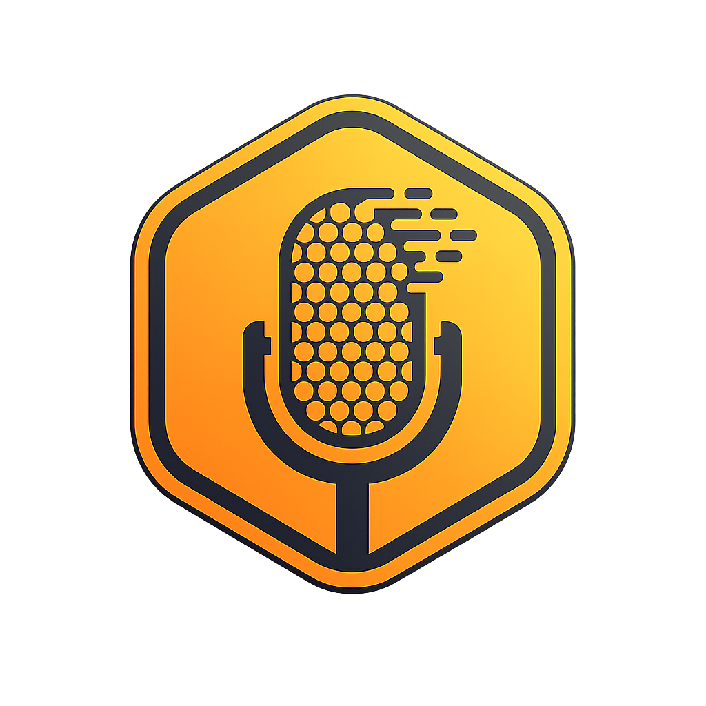

<p align="center">
  
</p>

<h1 align="center">Beeamvo</h1>

<p align="center">
  <strong>Offline-first voice-to-text with global hotkey support</strong>
</p>

<p align="center">
  <a href="https://github.com/justingorczyca/Beeamvo/releases"></a>
  <a href="LICENSE"></a>
  
  
</p>

---

Press a global hotkey anywhere, speak, and your words are typed at the cursor — no window switching. Beeamvo runs fully offline with [whisper.cpp](https://github.com/ggerganov/whisper.cpp), or connects to Google Gemini / Vertex AI for cloud transcription with AI-powered refinement.

## How it works

1. Press `Ctrl + Shift + V` (configurable) in any application.
2. Speak. A floating orb shows the recording state.
3. Press the hotkey again (or `Enter`) to stop — the transcription is pasted at your cursor.

## Quick Start

### Prerequisites

| Platform | Requirements |
|----------|--------------|
| **Windows** | Flutter 3.44+ (stable), Visual Studio 2022 with the *Desktop development with C++* workload |
| **macOS** | Flutter 3.44+ (stable), Xcode 15+, CocoaPods |

### Build and run from source

```bash
git clone https://github.com/justingorczyca/Beeamvo.git
cd Beeamvo/frontend
flutter pub get
flutter run -d windows    # or: flutter run -d macos
```

### Release build

```bash
cd frontend
flutter build windows --release    # or: flutter build macos --release
```

## Transcription Engines

Pick the engine that fits your workflow — switch anytime from Settings or the tray menu.

### Whisper (local, offline)

No account, no network, no data leaving your machine.

1. Settings → Intelligence → **Processing Engine** → Whisper Local
2. Download a model (Tiny, ~75 MB, is a good start)
3. Start recording

Available models: Tiny, Tiny English, Tiny Q5 (~32 MB), Base, Small. Models are downloaded from Hugging Face into your user data directory.

### Gemini API key (cloud)

The fastest cloud setup — no Google Cloud project needed.

1. Create an API key in [Google AI Studio](https://aistudio.google.com/apikey)
2. Settings → Intelligence → **Cloud Provider** → Gemini API Key
3. Click **Add API Key**, paste the key, save, then **Verify**

Your key is stored in **OS secure storage** (Keychain on macOS, platform secure storage on Windows) — never in plaintext files. See [docs/gemini-api-setup.md](docs/gemini-api-setup.md).

### Vertex AI (cloud, Google Cloud)

For users with existing Google Cloud infrastructure.

1. Authenticate with Application Default Credentials:

   ```bash
   gcloud auth application-default login
   ```

2. Settings → Intelligence → **Cloud Provider** → Vertex AI
3. Enter your Google Cloud project ID, then **Verify**

Full guide: [docs/vertex-rest-setup.md](docs/vertex-rest-setup.md)

## Features

| | |
|---|---|
| **Recording modes** | Toggle (press to start/stop) or Hold (hold to record) |
| **Auto-paste** | Transcription is pasted at the cursor automatically |
| **Cancel / commit** | `Esc` cancels, `Enter` commits early |
| **Cloud models** | Gemini 2.5 Flash, 2.5 Flash Lite, 3 Flash (preview), 3.5 Flash, 3.1 Flash Lite |
| **Thinking levels** | Minimal / Low / Medium / High (Gemini 3+ models) |
| **Two-pass refinement** | Local Whisper transcription followed by an AI polish pass |
| **System prompts** | Built-in prompts plus unlimited custom prompts |
| **Rephraser** | Off / Medium / High — professional polish on top of any prompt |
| **Clipboard history** | Auto-saved transcriptions, full-text search, pinning |
| **System tray** | Switch prompts, rephraser levels, and models without opening Settings |
| **Languages** | Auto-detect, English, German, French, Spanish (Whisper) |

## Default Hotkeys

| Hotkey | Action |
|--------|--------|
| `Ctrl + Shift + V` | Start / stop recording |
| `Ctrl + Shift + H` | Open clipboard history |
| `Escape` | Cancel recording |
| `Enter` | Commit recording early (toggle mode) |

All hotkeys are configurable in **Settings → General**.

## Privacy & Security

- **Offline by default** — with Whisper Local, audio never leaves your machine.
- **API keys live in OS secure storage**, entered through the UI. They are sent to Google only via request headers, never logged or written to plaintext files.
- **Development-only `.env`**: contributors can copy `frontend/.env.example` to `frontend/.env` to set `GEMINI_API_KEY` / `VERTEX_PROJECT_ID` during development. Release builds ignore dotenv files entirely, and `.env` is gitignored.

If you find a security issue, please report it privately to the maintainer rather than opening a public issue, and never include API keys, transcripts, or logs in bug reports.

## Development

```bash
cd frontend
flutter pub get
flutter analyze          # static analysis
flutter test             # unit & widget tests
```

Before publishing source or binary releases, follow [docs/open-source-release-checklist.md](docs/open-source-release-checklist.md).

### Project structure

```
├── frontend/                 # Flutter application
│   ├── lib/
│   │   ├── services/         # Core logic (recording, transcription, hotkeys, secure storage, ...)
│   │   ├── widgets/          # UI (floating orb, settings, onboarding)
│   │   ├── providers/        # State management (Provider / ChangeNotifier)
│   │   ├── models/           # Data models
│   │   └── theme/            # Dark theme & styling
│   ├── windows/runner/       # Windows native layer (C++, Win32, whisper.cpp)
│   ├── macos/Runner/         # macOS native layer (Swift, Metal, vendored whisper.cpp)
│   ├── linux/runner/         # Linux native layer (experimental)
│   ├── assets/               # Icons & images
│   └── test/                 # Tests
└── docs/                     # Setup guides & release checklist
```

## License

MIT — see [LICENSE](LICENSE). Third-party notices are collected in [docs/THIRD_PARTY_NOTICES.md](docs/THIRD_PARTY_NOTICES.md). Version history lives in [CHANGELOG.md](CHANGELOG.md).

## Acknowledgments

- [whisper.cpp](https://github.com/ggerganov/whisper.cpp) by Georgi Gerganov — high-performance Whisper inference (vendored under its MIT license)
- [Whisper](https://github.com/openai/whisper) by OpenAI — the underlying speech-recognition models
- The Flutter, Dart, and open-source package maintainers listed in `frontend/pubspec.yaml`
