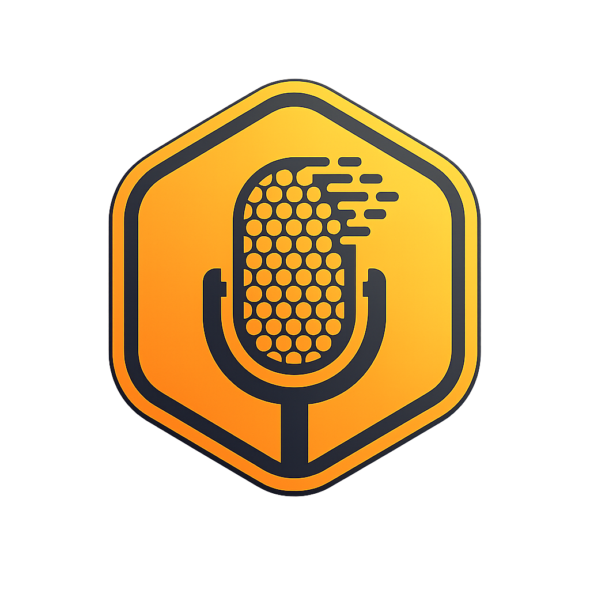

<p align="center">
  
</p>

<h1 align="center">Beeamvo</h1>

<p align="center">
  <strong>Offline-first voice-to-text with global hotkey support</strong>
</p>

<p align="center">
  <a href="LICENSE"></a>
  
  
  
</p>

---

Press a global hotkey anywhere, speak, and your words are typed at the cursor — no window switching. Beeamvo runs fully offline with [whisper.cpp](https://github.com/ggerganov/whisper.cpp), or connects to Google Gemini / Vertex AI for cloud transcription with AI-powered refinement.

## How it works

1. Press `Ctrl + Shift + V` (configurable) in any application.
2. Speak. A floating orb shows the recording state.
3. Press the hotkey again (or `Enter`) to stop — the transcription is pasted at your cursor.

## Quick Start

### Supported platforms

| Platform | Status | Runtime note |
|----------|--------|--------------|
| **Windows 10/11** | Supported | — |
| **macOS 13.0 (Ventura) or later** | Supported | App Sandbox is **intentionally off** (see [Platform & build notes](#platform--build-notes)); signed/notarized binaries are a separate, not-yet-built release step. |
| **Linux** | Experimental | A complete native runner exists and is built in CI, but it has not yet shipped to end users. Treat it as community-supported until it stabilizes. |

### Prerequisites

| Platform | Requirements |
|----------|--------------|
| **Windows** | Flutter 3.44+ (stable), Visual Studio 2022 with the *Desktop development with C++* workload |
| **macOS** | Flutter 3.44+ (stable), Xcode 15+, CocoaPods. Builds target macOS 13.0 (Ventura). |
| **Linux** (experimental) | Flutter 3.44+ (stable) with Linux desktop enabled (`flutter config --enable-linux-desktop`), plus `clang`, `cmake`, `ninja-build`, `pkg-config`, `libgtk-3-dev`, `liblzma-dev`, `libstdc++-12-dev` |

> **whisper.cpp build model.** On **macOS**, the app links a **bundled local copy** under `frontend/macos/Runner/whisper.cpp/` (no network needed to build). On **Windows and Linux**, the native runner downloads the whisper.cpp source from GitHub via CMake `FetchContent` at **build time**, pinned to upstream commit `9386f239401074690479731c1e41683fbbeac557` (**v1.8.4**) — so the first build for those platforms requires an internet connection. The pin lives in `frontend/windows/runner/CMakeLists.txt` and `frontend/linux/runner/CMakeLists.txt`. All three platforms end up building the **same whisper.cpp v1.8.4**.

### Build and run from source

```bash
git clone https://github.com/justingorczyca/Beeamvo.git
cd Beeamvo/frontend
flutter pub get
flutter run -d windows    # or: flutter run -d macos | flutter run -d linux
```

> The CI gate (`flutter pub get --enforce-lockfile`) resolves exactly the versions pinned in `frontend/pubspec.lock`, so it requires no network beyond `pub get` (and the whisper.cpp build fetch on Windows/Linux).

### Release build

```bash
cd frontend
flutter build windows --release    # or: flutter build macos --release | flutter build linux --release
```

`flutter build` produces a raw executable/bundle per platform, **not** an installer. There is no `.dmg`/MSIX/installer or signed, notarized binary release yet.

## Transcription Engines

Pick the engine that fits your workflow — switch anytime from Settings or the tray menu.

### Whisper (local, offline)

No account, no network, no data leaving your machine.

1. Settings → Intelligence → **Processing Engine** → Whisper Local
2. Download a model (Tiny, ~75 MB, is a good start)
3. Start recording

Available models: Tiny, Tiny English, Tiny Q5 (~32 MB), Base, Small. Models are downloaded from Hugging Face into your user data directory.

### Gemini API key (cloud)

The fastest cloud setup — no Google Cloud project needed. Audio is sent to Google's Gemini API for transcription (and optional AI refinement); a confirmation dialog appears the first time you switch an offline-only prompt to a cloud pipeline.

1. Create an API key in [Google AI Studio](https://aistudio.google.com/apikey)
2. Settings → Intelligence → **Cloud Provider** → Gemini API Key
3. Click **Add API Key**, paste the key, save, then **Verify**

In the Gemini API Key settings, choose the recommended **Interactions** API
surface or the legacy `generateContent` surface. The legacy option remains the
default for existing installations.

Your key is stored in **OS secure storage** (Keychain on macOS, platform secure storage on Windows) — never in plaintext files. See [docs/gemini-api-setup.md](docs/gemini-api-setup.md).

### Vertex AI (cloud, Google Cloud)

For users with existing Google Cloud infrastructure.

1. Authenticate with Application Default Credentials:

   ```bash
   gcloud auth application-default login
   ```

2. Settings → Intelligence → **Cloud Provider** → Vertex AI
3. Enter your Google Cloud project ID, then **Verify**

Full guide: [docs/vertex-rest-setup.md](docs/vertex-rest-setup.md)

## Features

| | |
|---|---|
| **Recording modes** | Toggle (press to start/stop) or Hold (hold to record) |
| **Auto-paste** | Transcription is pasted at the cursor automatically |
| **Cancel / commit** | `Esc` cancels, `Enter` commits early |
| **Cloud models** | Gemini 2.5 Flash, 2.5 Flash Lite, 3.7 Flash, 3 Flash (preview), 3.5 Flash, 3.1 Flash Lite |
| **Thinking levels** | Minimal / Low / Medium / High (Gemini 3+ models) |
| **Two-pass refinement** | Local Whisper transcription followed by an AI polish pass |
| **System prompts** | Built-in prompts plus unlimited custom prompts |
| **Rephraser** | Off / Medium / High — professional polish on top of any prompt |
| **Clipboard history** | Auto-saved transcriptions, full-text search, pinning |
| **System tray** | Switch prompts, rephraser levels, and models without opening Settings |
| **Languages** | Auto-detect, English, German, French, Spanish (Whisper) |

## Default Hotkeys

| Hotkey | Action |
|--------|--------|
| `Ctrl + Shift + V` | Start / stop recording |
| `Ctrl + Shift + H` | Open clipboard history |
| `Escape` | Cancel recording |
| `Enter` | Commit recording early (toggle mode) |

All hotkeys are configurable in **Settings → General**.

## Privacy & Security

- **Offline by default** — with Whisper Local, audio never leaves your machine.
- **Cloud is opt-in** — Gemini API and Vertex AI only run when you choose Cloud (or enable two-pass refinement). The first time a cloud model enters the pipeline you get a confirmation dialog, so audio is never sent silently.
- **API keys live in OS secure storage**, entered through the UI. They are sent to Google only via request headers, never logged or written to plaintext files. (Vertex AI uses Application Default Credentials — no stored secret.)
- **Cloud connections use standard TLS** — Gemini API, Vertex AI, model downloads, and update checks go over HTTPS and are validated by your operating system's certificate trust store. Certificate pinning is **not** used; keep your OS and trusted root certificates up to date.
- **Local storage** — settings, model files, usage statistics, and clipboard history live in your OS application-data directory under your user account. Clipboard history is stored as **plaintext**; enable a best-effort sensitive-text filter in Settings, and avoid enabling history for sensitive work.
- **Development-only `.env`**: contributors can copy `frontend/.env.example` to `frontend/.env` to set `GEMINI_API_KEY` / `VERTEX_PROJECT_ID` during development. Release builds ignore dotenv files entirely, and `.env` is gitignored.

For vulnerability reporting, see [SECURITY.md](SECURITY.md).

## Development

```bash
cd frontend
flutter pub get
flutter analyze          # static analysis
flutter test             # unit & widget tests
```

The same steps (plus a per-platform `flutter build`) run in CI — see [`.github/workflows/ci.yml`](.github/workflows/ci.yml). See [CONTRIBUTING.md](CONTRIBUTING.md) for the contribution workflow.

### Project structure

```
├── frontend/                 # Flutter application
│   ├── lib/
│   │   ├── services/         # Core logic (recording, transcription, hotkeys, secure storage, ...)
│   │   ├── widgets/          # UI (floating orb, settings, onboarding)
│   │   ├── providers/        # State management (Provider / ChangeNotifier)
│   │   ├── models/           # Data models
│   │   └── theme/            # Dark theme & styling
│   ├── windows/runner/       # Windows native layer (C++, Win32); builds whisper.cpp from pinned upstream v1.8.4
│   ├── macos/Runner/         # macOS native layer (Swift, Metal); links a bundled local whisper.cpp
│   ├── linux/runner/         # Linux native layer (experimental); builds whisper.cpp from pinned upstream v1.8.4
│   ├── assets/               # Icons & images
│   └── test/                 # Tests
└── docs/                     # Setup guides & third-party notices
```

## Platform & build notes

- **macOS — App Sandbox is intentionally off.** Beeamvo relies on Accessibility + cross-application keyboard event injection for auto-paste and on the legacy login-item API for launch-at-startup, both of which the sandbox restricts. Enabling it would require a product redesign. Source builds you run yourself inherit your own machine's trust boundary.
- **macOS — signing/notarization is for distributed binaries only.** The committed macOS code-signing tooling (`frontend/macos/setup_codesign.sh`, `frontend/macos/CODESIGN_README.md`, `frontend/scripts/build_signed_macos.sh`) creates a **local self-signed certificate** and is **development-only, not for distribution**. A public `.app`/`.dmg` still needs Hardened Runtime, a Developer ID, and notarization — none of which exist yet.
- **Linux is experimental.** It is built in CI but has not been distributed. If the CI Linux build turns out to be flaky on hosted runners, the honest fallback is "provided experimentally, community-maintained."
- **No mobile or web targets.** This is a desktop-only app (no Android/iOS/web build config).

## Troubleshooting

- **macOS: auto-paste stops working after a rebuild** — ad-hoc signed builds get a new signature each time, so the Accessibility permission goes stale. Rebuild with a stable self-signed identity (see [frontend/macos/CODESIGN_README.md](frontend/macos/CODESIGN_README.md)) or use **Settings → Troubleshooting → Auto-repair**, which resets only Beeamvo's TCC entry.
- **Cloud says "no API key" or "no project ID"** — set the Gemini key or Vertex project ID in **Settings → Intelligence**. See [docs/gemini-api-setup.md](docs/gemini-api-setup.md) / [docs/vertex-rest-setup.md](docs/vertex-rest-setup.md).
- **First Windows/Linux build needs the internet** — whisper.cpp is fetched from the pinned upstream commit at build time (see the note above).
- **A non-default prompt "has no effect"** — on the offline Whisper backend with two-pass refinement off, only verbatim transcription runs. Switch to Cloud or enable two-pass refinement to apply prompts and the Rephraser. The app surfaces this in the mode popup and Settings.
- More help is available in **Settings → Troubleshooting**.

## Known limitations

- No installer/artifact packaging, SBOM, or signed, notarized binary release yet (source-only at present).
- First-time transcription has a short warm-up while the Whisper model loads.
- Inline audio requests for cloud providers have a size cap; very long recordings should use a shorter duration limit.
- Cloud transcription is not cancelled mid-request; pressing escape finishes any in-flight network call.

## License

MIT — see [LICENSE](LICENSE). Third-party notices are collected in [docs/THIRD_PARTY_NOTICES.md](docs/THIRD_PARTY_NOTICES.md). Version history lives in [CHANGELOG.md](CHANGELOG.md).

> **What the MIT license covers.** The MIT license applies to Beeamvo's own source code and to the bundled/vendored **whisper.cpp** source (also MIT). The **Whisper model weights** that Beeamvo downloads at runtime are derived from OpenAI's Whisper models and are **also MIT-licensed** — [verify the current terms on the model card](https://huggingface.co/ggerganov/whisper.cpp). Typefaces loaded at runtime via `google_fonts` are **not** covered by this license — each font has its own terms on [Google Fonts](https://fonts.google.com/).

## Acknowledgments

- [whisper.cpp](https://github.com/ggerganov/whisper.cpp) by Georgi Gerganov (ggml-org) — high-performance Whisper inference under the MIT license. macOS links a bundled local copy; Windows and Linux fetch the MIT-licensed source from a pinned upstream commit (v1.8.4) at build time.
- [Whisper](https://github.com/openai/whisper) by OpenAI — the underlying speech-recognition models
- The Flutter, Dart, and open-source package maintainers listed in `frontend/pubspec.yaml`
